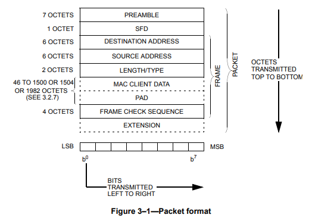

## 项目概述

## 项目配置

### node 与 npm 的配置
nvm: `1.1.7`  
npm: `6.13.4`
node: `12.16.0`
yarn: `1.22.0`

#### 安装nvm
Windows下在[此处](https://github.com/coreybutler/nvm-windows/releases)下载最新nvm并安装。其他平台请参考此处[https://www.runoob.com/w3cnote/nvm-manager-node-versions.html](https://www.runoob.com/w3cnote/nvm-manager-node-versions.html)。安装成功后，在控制台输入`nvm version`应该可以看到版本号
```
> nvm version
1.1.7
```
使用nvm对不同版本的npm与node进行管理，首先配置淘宝镜像。控制台中输入`nvm root`查看nvm安装目录(此处是**我的**安装目录)
```
> nvm root

Current Root: D:\nvm

```
找到里面的`settings.txt`，在最后加入这两行：
```
node_mirror: https://npm.taobao.org/mirrors/node/
npm_mirror: https://npm.taobao.org/mirrors/npm/
```
最后的文件内容（可能与读者的略有不同）
```
root: D:\nvm
path: D:\Program Files\nodejs
node_mirror: https://npm.taobao.org/mirrors/node/
npm_mirror: https://npm.taobao.org/mirrors/npm/
```
然后重新打开一个cmd， 输入`nvm install [your-node/npm-version]`即可安装对应版本的node与npm
```
> nvm install 12.16.0
```
安装成功后，切换node版本到12.16.0
```
> nvm use 12.16.0
```

### 模块
**cnpm**
国内使用cnpm是一个比较方便的选择，安装方法如下
```
> npm install cnpm -g --registry=https://registry.npm.taobao.org
```
**yarn**
使用npm安装
```
> cnpm install -g yarn
```
使用淘宝镜像
```
> yarn config set registry https://registry.npm.taobao.org --global
> yarn config set disturl https://npm.taobao.org/dist --global
```
**electron**
**vue-cli**
**electron-vue**
**坑 1-1 运行electron时出现`ReferenceError`**
```
  ERROR in Template execution failed: ReferenceError: process is not defined

  ERROR in   ReferenceError: process is not defined

    - index.ejs:11 eval
      [.]/[html-webpack-plugin]/lib/loader.js!./src/index.ejs:11:2

    - index.ejs:16 module.exports
      [.]/[html-webpack-plugin]/lib/loader.js!./src/index.ejs:16:3

    - index.js:284
      [network_snipper]/[html-webpack-plugin]/index.js:284:18

    - runMicrotasks

    - task_queues.js:97 processTicksAndRejections
      internal/process/task_queues.js:97:5
```
**解决方案**
**ant-design**
```
yarn add ant-design-vue
```
使用[官网](https://www.antdv.com/docs/vue/introduce-cn/)推荐的babel引入方式
```js
// .babelrc or babel-loader option
{
  "plugins": [
    ["import", { "libraryName": "ant-design-vue", "libraryDirectory": "es", "style": "css" }] // `style: true` 会加载 less 文件
  ]
}
```
坑1-2 `cnpm run dev`时出现错误`ReferenceError: Unknown plugin "***"`
安装`babel-plugin-***`即可
```
> cnpm install babel-plugin-import -D
```
坑1-3 运行electron出现
```
┏ Electron -------------------

  Failed to fetch extension, trying 4 more times

┗ ----------------------------
...
```
实际上是网络问题，第一次运行时会下载vue tool插件，使用科学的方法之后可√，无视也可。

### websocket 通信实现
安装nodejs-websocket
```
> cnpm install nodejs-websocket -g
```
### Winpcap的配置

## 项目实现
### 数据帧结构分析



### ip数据包 protocol number
协议数据来自<sup>[[1]](#refer-1)</sup>
获取数据之后用正则表达式略做处理
```python
[{"code": 0, "keyword": "HOPOPT", "description": "IPv6 Hop-by-Hop Option"},
{"code": 1, "keyword": "ICMP", "description": "Internet Control Message"},
{"code": 2, "keyword": "IGMP", "description": "Internet Group Management"},
{"code": 3, "keyword": "GGP", "description": "Gateway-to-Gateway"},
{"code": 4, "keyword": "IPv4", "description": "IPv4 encapsulation"},
{"code": 5, "keyword": "ST", "description": "Stream"},
{"code": 6, "keyword": "TCP", "description": "Transmission Control"},
{"code": 7, "keyword": "CBT", "description": "CBT"},
{"code": 8, "keyword": "EGP", "description": "Exterior Gateway Protocol"},
{"code": 9, "keyword": "IGP", "description": "any private interior gateway (used by Cisco for their IGRP)"},
{"code": 10, "keyword": "BBN-RCC-MON", "description": "BBN RCC Monitoring"},
{"code": 11, "keyword": "NVP-II", "description": "Network Voice Protocol"},
{"code": 12, "keyword": "PUP", "description": "PUP"},
{"code": 13, "keyword": "ARGUS (deprecated)", "description": "ARGUS"},
{"code": 14, "keyword": "EMCON", "description": "EMCON"},
{"code": 15, "keyword": "XNET", "description": "Cross Net Debugger"},
{"code": 16, "keyword": "CHAOS", "description": "Chaos"},
{"code": 17, "keyword": "UDP", "description": "User Datagram"},
{"code": 18, "keyword": "MUX", "description": "Multiplexing"},
{"code": 19, "keyword": "DCN-MEAS", "description": "DCN Measurement Subsystems"},
{"code": 20, "keyword": "HMP", "description": "Host Monitoring"},
{"code": 21, "keyword": "PRM", "description": "Packet Radio Measurement"},
{"code": 22, "keyword": "XNS-IDP", "description": "XEROX NS IDP"},
{"code": 23, "keyword": "TRUNK-1", "description": "Trunk-1"},
{"code": 24, "keyword": "TRUNK-2", "description": "Trunk-2"},
{"code": 25, "keyword": "LEAF-1", "description": "Leaf-1"},
{"code": 26, "keyword": "LEAF-2", "description": "Leaf-2"},
{"code": 27, "keyword": "RDP", "description": "Reliable Data Protocol"},
{"code": 28, "keyword": "IRTP", "description": "Internet Reliable Transaction"},
{"code": 29, "keyword": "ISO-TP4", "description": "ISO Transport Protocol Class 4"},
{"code": 30, "keyword": "NETBLT", "description": "Bulk Data Transfer Protocol"},
{"code": 31, "keyword": "MFE-NSP", "description": "MFE Network Services Protocol"},
{"code": 32, "keyword": "MERIT-INP", "description": "MERIT Internodal Protocol"},
{"code": 33, "keyword": "DCCP", "description": "Datagram Congestion Control Protocol"},
{"code": 34, "keyword": "3PC", "description": "Third Party Connect Protocol"},
{"code": 35, "keyword": "IDPR", "description": "Inter-Domain Policy Routing Protocol"},
{"code": 36, "keyword": "XTP", "description": "XTP"},
{"code": 37, "keyword": "DDP", "description": "Datagram Delivery Protocol"},
{"code": 38, "keyword": "IDPR-CMTP", "description": "IDPR Control Message Transport Proto"},
{"code": 39, "keyword": "TP++", "description": "TP++ Transport Protocol"},
{"code": 40, "keyword": "IL", "description": "IL Transport Protocol"},
{"code": 41, "keyword": "IPv6", "description": "IPv6 encapsulation"},
{"code": 42, "keyword": "SDRP", "description": "Source Demand Routing Protocol"},
{"code": 43, "keyword": "IPv6-Route", "description": "Routing Header for IPv6"},
{"code": 44, "keyword": "IPv6-Frag", "description": "Fragment Header for IPv6"},
{"code": 45, "keyword": "IDRP", "description": "Inter-Domain Routing Protocol"},
{"code": 46, "keyword": "RSVP", "description": "Reservation Protocol"},
{"code": 47, "keyword": "GRE", "description": "Generic Routing Encapsulation"},
{"code": 48, "keyword": "DSR", "description": "Dynamic Source Routing Protocol"},
{"code": 49, "keyword": "BNA", "description": "BNA"},
{"code": 50, "keyword": "ESP", "description": "Encap Security Payload"},
{"code": 51, "keyword": "AH", "description": "Authentication Header"},
{"code": 52, "keyword": "I-NLSP", "description": "Integrated Net Layer Security  TUBA"},
{"code": 53, "keyword": "SWIPE (deprecated)", "description": "IP with Encryption"},
{"code": 54, "keyword": "NARP", "description": "NBMA Address Resolution Protocol"},
{"code": 55, "keyword": "MOBILE", "description": "IP Mobility"},
{"code": 56, "keyword": "TLSP", "description": "Transport Layer Security Protocol using Kryptonet key management"},
{"code": 57, "keyword": "SKIP", "description": "SKIP"},
{"code": 58, "keyword": "IPv6-ICMP", "description": "ICMP for IPv6"},
{"code": 59, "keyword": "IPv6-NoNxt", "description": "No Next Header for IPv6"},
{"code": 60, "keyword": "IPv6-Opts", "description": "Destination Options for IPv6"},
{"code": 61, "keyword": "", "description": "any host internal protocol"},
{"code": 62, "keyword": "CFTP", "description": "CFTP"},
{"code": 63, "keyword": "", "description": "any local network"},
{"code": 64, "keyword": "SAT-EXPAK", "description": "SATNET and Backroom EXPAK"},
{"code": 65, "keyword": "KRYPTOLAN", "description": "Kryptolan"},
{"code": 66, "keyword": "RVD", "description": "MIT Remote Virtual Disk Protocol"},
{"code": 67, "keyword": "IPPC", "description": "Internet Pluribus Packet Core"},
{"code": 68, "keyword": "", "description": "any distributed file system"},
{"code": 69, "keyword": "SAT-MON", "description": "SATNET Monitoring"},
{"code": 70, "keyword": "VISA", "description": "VISA Protocol"},
{"code": 71, "keyword": "IPCV", "description": "Internet Packet Core Utility"},
{"code": 72, "keyword": "CPNX", "description": "Computer Protocol Network Executive"},
{"code": 73, "keyword": "CPHB", "description": "Computer Protocol Heart Beat"},
{"code": 74, "keyword": "WSN", "description": "Wang Span Network"},
{"code": 75, "keyword": "PVP", "description": "Packet Video Protocol"},
{"code": 76, "keyword": "BR-SAT-MON", "description": "Backroom SATNET Monitoring"},
{"code": 77, "keyword": "SUN-ND", "description": "SUN ND PROTOCOL-Temporary"},
{"code": 78, "keyword": "WB-MON", "description": "WIDEBAND Monitoring"},
{"code": 79, "keyword": "WB-EXPAK", "description": "WIDEBAND EXPAK"},
{"code": 80, "keyword": "ISO-IP", "description": "ISO Internet Protocol"},
{"code": 81, "keyword": "VMTP", "description": "VMTP"},
{"code": 82, "keyword": "SECURE-VMTP", "description": "SECURE-VMTP"},
{"code": 83, "keyword": "VINES", "description": "VINES"},
{"code": 84, "keyword": "TTP", "description": "Transaction Transport Protocol"},
{"code": 84, "keyword": "IPTM", "description": "Internet Protocol Traffic Manager"},
{"code": 85, "keyword": "NSFNET-IGP", "description": "NSFNET-IGP"},
{"code": 86, "keyword": "DGP", "description": "Dissimilar Gateway Protocol"},
{"code": 87, "keyword": "TCF", "description": "TCF"},
{"code": 88, "keyword": "EIGRP", "description": "EIGRP"},
{"code": 89, "keyword": "OSPFIGP", "description": "OSPFIGP"},
{"code": 90, "keyword": "Sprite-RPC", "description": "Sprite RPC Protocol"},
{"code": 91, "keyword": "LARP", "description": "Locus Address Resolution Protocol"},
{"code": 92, "keyword": "MTP", "description": "Multicast Transport Protocol"},
{"code": 93, "keyword": "AX.25", "description": "AX.25 Frames"},
{"code": 94, "keyword": "IPIP", "description": "IP-within-IP Encapsulation Protocol"},
{"code": 95, "keyword": "MICP (deprecated)", "description": "Mobile Internetworking Control Pro."},
{"code": 96, "keyword": "SCC-SP", "description": "Semaphore Communications Sec. Pro."},
{"code": 97, "keyword": "ETHERIP", "description": "Ethernet-within-IP Encapsulation"},
{"code": 98, "keyword": "ENCAP", "description": "Encapsulation Header"},
{"code": 99, "keyword": "", "description": "any private encryption scheme"},
{"code": 100, "keyword": "GMTP", "description": "GMTP"},
{"code": 101, "keyword": "IFMP", "description": "Ipsilon Flow Management Protocol"},
{"code": 102, "keyword": "PNNI", "description": "PNNI over IP"},
{"code": 103, "keyword": "PIM", "description": "Protocol Independent Multicast"},
{"code": 104, "keyword": "ARIS", "description": "ARIS"},
{"code": 105, "keyword": "SCPS", "description": "SCPS"},
{"code": 106, "keyword": "QNX", "description": "QNX"},
{"code": 107, "keyword": "A/N", "description": "Active Networks"},
{"code": 108, "keyword": "IPComp", "description": "IP Payload Compression Protocol"},
{"code": 109, "keyword": "SNP", "description": "Sitara Networks Protocol"},
{"code": 110, "keyword": "Compaq-Peer", "description": "Compaq Peer Protocol"},
{"code": 111, "keyword": "IPX-in-IP", "description": "IPX in IP"},
{"code": 112, "keyword": "VRRP", "description": "Virtual Router Redundancy Protocol"},
{"code": 113, "keyword": "PGM", "description": "PGM Reliable Transport Protocol"},
{"code": 114, "keyword": "", "description": "any 0-hop protocol"},
{"code": 115, "keyword": "L2TP", "description": "Layer Two Tunneling Protocol"},
{"code": 116, "keyword": "DDX", "description": "D-II Data Exchange (DDX)"},
{"code": 117, "keyword": "IATP", "description": "Interactive Agent Transfer Protocol"},
{"code": 118, "keyword": "STP", "description": "Schedule Transfer Protocol"},
{"code": 119, "keyword": "SRP", "description": "SpectraLink Radio Protocol"},
{"code": 120, "keyword": "UTI", "description": "UTI"},
{"code": 121, "keyword": "SMP", "description": "Simple Message Protocol"},
{"code": 122, "keyword": "SM (deprecated)", "description": "Simple Multicast Protocol"},
{"code": 123, "keyword": "PTP", "description": "Performance Transparency Protocol"},
{"code": 124, "keyword": "ISIS over IPv4", "description": ""},
{"code": 125, "keyword": "FIRE", "description": ""},
{"code": 126, "keyword": "CRTP", "description": "Combat Radio Transport Protocol"},
{"code": 127, "keyword": "CRUDP", "description": "Combat Radio User Datagram"},
{"code": 128, "keyword": "SSCOPMCE", "description": ""},
{"code": 129, "keyword": "IPLT", "description": ""},
{"code": 130, "keyword": "SPS", "description": "Secure Packet Shield"},
{"code": 131, "keyword": "PIPE", "description": "Private IP Encapsulation within IP"},
{"code": 132, "keyword": "SCTP", "description": "Stream Control Transmission Protocol"},
{"code": 133, "keyword": "FC", "description": "Fibre Channel"},
{"code": 134, "keyword": "RSVP-E2E-IGNORE", "description": ""},
{"code": 135, "keyword": "Mobility Header", "description": ""},
{"code": 136, "keyword": "UDPLite", "description": ""},
{"code": 137, "keyword": "MPLS-in-IP", "description": ""},
{"code": 138, "keyword": "manet", "description": "MANET Protocols"},
{"code": 139, "keyword": "HIP", "description": "Host Identity Protocol"},
{"code": 140, "keyword": "Shim6", "description": "Shim6 Protocol"},
{"code": 141, "keyword": "WESP", "description": "Wrapped Encapsulating Security Payload"},
{"code": 142, "keyword": "ROHC", "description": "Robust Header Compression"},
{"code": 143, "keyword": "Ethernet", "description": "Ethernet (TEMPORARY - registered 2020-01-31, expires 2021-01-31)"},
144-{"code": 252, "keyword": "", "description": "Unassigned"},
{"code": 253, "keyword": "", "description": "Use for experimentation and testing"},
{"code": 254, "keyword": "", "description": "Use for experimentation and testing"},
{"code": 255, "keyword": "Reserved", "description": ""}]
```
### C++调用Winpcap

### Electron桌面应用开发

### Socket通信传输抓包信息

### 整合与打包

## 参考文献
[1] <span id="refer-1">Protocol Number</span> http://www.ferrisxu.com/WinPcap/html/index.html

