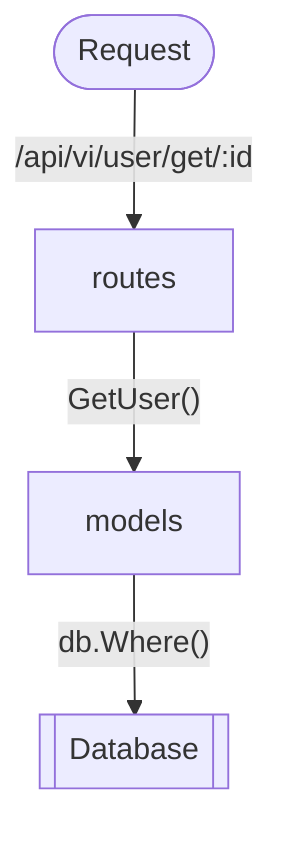

## 前言

曾经使用过Java的`Spring MVC`框架的读者可能对三层架构有一定印象

`Controller`层: 控制器,层 与用户直接交互的表现层

`Service`层: 为`Controller`层提供服务, 同时与数据持久层交互

`DAO`层: 数据持久层, 负责数据库操作

`Entity`: 实体定义

在笔者的理解中, Go项目包与这三层的对应关系可能是:

`models` <=> `Entity` + `DAO`

`services` <=> `Service`

`routers`  <=>  `Controller`

接下来我们就先从`routers`开始吧

## 接口定义

为了方便之后对api进行更新迭代, 我们姑且将当前版本的api称作`v1`

约定操作对应的URI如下

| Operation | URI                     |
| --------- | ----------------------- |
| 添加      | `POST /entity/add`      |
| 更新      | `POST /entity/save/:id` |
| 删除      | `POST /entity/del/:id`  |
| 查询      | `GET  /entity/get/:id`  |

新建路径`./routers/api/v1`

当前项目结构如下

```
obm-back-end
├─conf
├─middleware
├─models
├─pkg
│  ├─e
│  └─setting
├─routes
│  └─api
│      └─v1
└─runtime
```

项目详细的接口定义请看 [此处]()

接下来就是传说中的 `CURD` 了

### user

创建`./routers/api/v1/user.go`

```go
package v1

import "github.com/gin-gonic/gin"

// GetAllUser Get all user from database
func GetAllUser(c *gin.Context) {

}

// GetUser Get single user by specified id
func GetUser(c *gin.Context) {

}

// AddUser add user
func AddUser(c *gin.Context) {

}

// EditUser edit user
func EditUser(c *gin.Context) {

}

// DeleteUser delete user
func DeleteUser(c *gin.Context) {

}
```

在`routes/routes.go`中注册路由信息

```go
package routes

import (
	"github.com/Jecosine/obm-back-end/pkg/setting"
	v1 "github.com/Jecosine/obm-back-end/routes/api/v1"
	"github.com/gin-gonic/gin"
)

func Init() *gin.Engine {
	r := gin.New()
	// use logger
	r.Use(gin.Logger())
	r.Use(gin.Recovery())
	gin.SetMode(setting.RunMode)
	apiV1 := r.Group("/api/v1")
	{
		apiV1.GET("/user/get/:id", v1.GetUser)
		apiV1.POST("/user/save/:id", v1.EditUser)
		apiV1.POST("/user/del/:id", v1.DeleteUser)
		apiV1.POST("/user/add/:id", v1.AddUser)
	}
	return r
}

```

其中

`gin.Engine`: 

`gin.New()`:

`gin.Logger()`: 

`gin.Recovery()`:

测试路由是否注册成功, 我们在`main.go`中编辑

```go
package main

import (
	"fmt"
	"net/http"

	"github.com/Jecosine/obm-back-end/models"
	"github.com/Jecosine/obm-back-end/pkg/setting"
	"github.com/Jecosine/obm-back-end/routes"
)

func main() {
	setting.Setup()
	models.Init()
	r := routes.Init()

	s := &http.Server{
		Addr:    fmt.Sprintf(":%d", setting.HTTPPort),
		Handler: r,
		MaxHeaderBytes: 1 << 20,
	}

	s.ListenAndServe()
}
```

执行

```shell
go run main.go
```

如果取得如下输出结果, 把我们刚才定义的所有api都打印出来的话, 就成功力

```
❯ go run main.go
2021/01/03 08:18:20 
RUN_MODE: debug
NAME: My Online Book Manager
HTTP_PORT: 8888
[GIN-debug] [WARNING] Running in "debug" mode. Switch to "release" mode in production.
 - using env:   export GIN_MODE=release
 - using code:  gin.SetMode(gin.ReleaseMode)

[GIN-debug] GET    /api/v1/user/get/:id      --> github.com/Jecosine/obm-back-end/routes/api/v1.GetUser (3 handlers)
[GIN-debug] POST   /api/v1/user/save/:id     --> github.com/Jecosine/obm-back-end/routes/api/v1.EditUser (3 handlers)
[GIN-debug] POST   /api/v1/user/del/:id      --> github.com/Jecosine/obm-back-end/routes/api/v1.DeleteUser (3 handlers)
[GIN-debug] POST   /api/v1/user/add/:id      --> github.com/Jecosine/obm-back-end/routes/api/v1.AddUser (3 handlers)
```

可能有的读者不太清楚请求的流程，下面的图演示了用户请求的处理流程



现在我们先编写和数据库交互的`models`

`models/user.go`

```go
package models

import (
	"log"
	"time"

	"github.com/jinzhu/gorm"
)

type User struct {
	Model

	ID       string `gorm:"primary_key" json:"id"`
	Username string `gorm:"column:username" json:"username"`
	Password string `json:"password"`
	Avatar   string `json:"avatar"`
	Email    string `json:"email"`
}

// set create time before insertion
func (user *User) BeforeCreate(scope *gorm.Scope) error {
	log.Println("[INFO] Really run? %s", time.Now().Format("2006-01-02 15:04:05"))
	scope.SetColumn("CreatedTime", time.Now().Unix())
	return nil
}

// set modified time before update
func (user *User) BeforeUpdate(scope *gorm.Scope) error {
	// scope.SetColumn("ModifiedTime", time.Now().Format("2006-01-02 15:04:05"))
	scope.SetColumn("ModifiedTime", time.Now().Unix())
	return nil
}
func ExistUserById(id string) bool {
	var user User
	db.Select("id").Where("id=?", id).First(&user)
	if len(user.ID) != 0 {
		return true
	}
	return false
}

// GetUsers Get users from database
func GetUsers() {

}

// GetUser Get single user by specified id
func GetUser(id string) (user User) {
	db.Where("id=?", id).First(&user)
	log.Printf("[INFO] In '/model/user.go': user id %s", user.ID)
	log.Printf("[INFO] In '/model/user.go': user name %s", user.Username)
	log.Printf("[INFO] In '/model/user.go': user password %s", user.Password)
	return user
}

func AddUser(user User) bool {
	log.Printf("[INFO] In '/model/user.go': user id %s", user.ID)
	log.Printf("[INFO] In '/model/user.go': user name %s", user.Username)
	log.Printf("[INFO] In '/model/user.go': user password %s", user.Password)
	db.Create(&user)
	return true
}

// EditUser edit user
func EditUser(id string, data interface{}) bool {
	db.Model(&User{}).Where("id=?", id).Updates(data)
	return true
}

// DeleteUser delete user
func DeleteUser(id string) bool {
	db.Where("id=?", id).Delete(User{})
	return true
}

```

